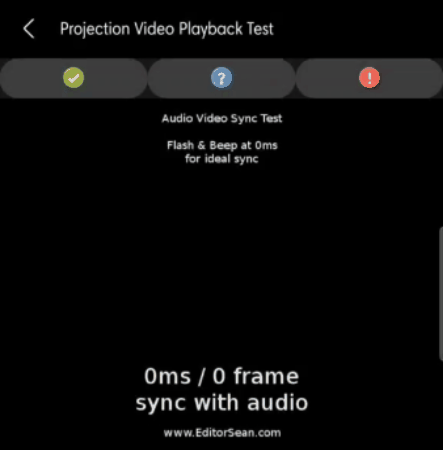

## Automating the Projection Video Playback test from Google's CTS Verifier test suite
The test consists of checking whether a flashing white box appears synchronized with a beep sound.

  

This automation uses Python and the OpenCV image recognition library, as well as the Librosa audio recognition library. The main objective of this code is to check if both elements are synchronized upon detecting the image and audio
